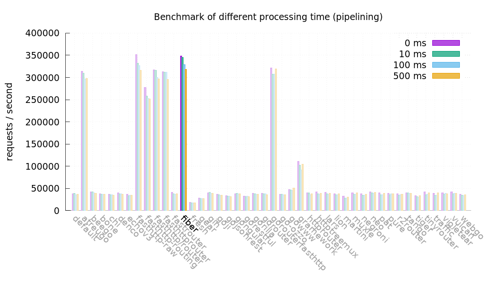
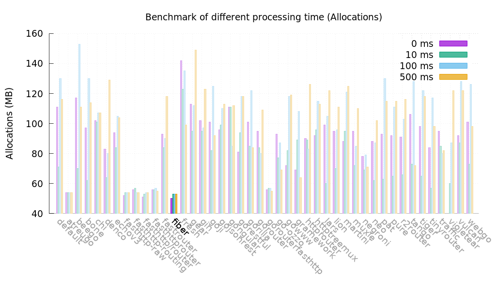
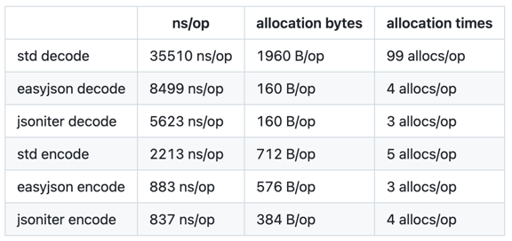

# Go Practices
These practices are based on my personal experiences and opinions. I am always open to better suggestions and would love to hear your thoughts for improvement!
## Table of Contents
- [Folder Structure](#folder-structure)
  - [pkg](#pkg)
  - [internal](#internal)
  - [container](#container)
- [Performance](#performance)
  - [Use Automaxprocs for GOMAXPROCS](#use-automaxprocs-for-gomaxprocs)
  - [Optimizing Struct Memory Layout](#optimizing-struct-memory-layout)
  - [Use GOMEMLIMIT Instead of GOGC](#use-gomemlimit-instead-of-gogc)
  - [Use fiber for Web Framework](#use-fiber-for-web-framework)
  - [Use unsafe package to string <-> byte conversion without copying](#use-unsafe-package-to-string---byte-conversion-without-copying)
  - [Use jsoniter instead of encoding/json](#use-jsoniter-instead-of-encodingjson)
  - [Use sync.Pool to reduce heap allocations](#use-syncpool-to-reduce-heap-allocations)
  - [Prefer strconv over fmt](#prefer-strconv-over-fmt)
  - [Prefer Specifying Capacity for Slices and Maps](#prefer-specifying-capacity-for-slices-and-maps)
- [Testing](#testing)
  - [Unit Testing for Usecases](#unit-testing-for-usecases)
  - [Using Mockery for Mock Generation](#using-mockery-for-mock-generation)
  - [Using Table-Driven Tests](#using-table-driven-tests)
  - [Running Tests with the Race Detector](#running-tests-with-the-race-detector)
- [Libraries](#libraries)
  - [mhmtszr/concurrent-swiss-map](#mhmtszrconcurrent-swiss-map)
  - [samber/lo](#samberlo)
  - [samber/do](#samberdo)
  - [json-iterator/go](#json-iteratorgo)
  - [uber-go/zap](#uber-gozap)
  - [uber-go/automaxprocs](#uber-goautomaxprocs)
  - [destel/rill](#destelrill)
  - [go-resty/resty](#go-restyresty)
  - [go-playground/validator](#go-playgroundvalidator)
- [Other Resources](#other-resources)

## Folder Structure

A well-organized Go project should follow a structured layout:

More detailed: https://github.com/golang-standards/project-layout

```
📂 project-root/
├── 📂 cmd/          # Main applications for the project
│   ├── 📂 app/
|   |   └── 📄 main.go
│   ...
├── 📂 internal/     # Private application
|   ├── 📂 <aggregate-root-1>/
|   |   |── 📄 usecase.go
|   |   └── ...
|   ├── 📂 <aggregate-root-2>/
|   |   |── 📄 usecase.go
|   |   └── ...
|   ...
├── 📂 pkg/          # Library code that can be used
├── 📂 configs/      # Configuration files and templates
├── 📂 scripts/      # Utility scripts (build, deploy, etc.)
├── 📂 test/         # Additional test data and mocks
├── 📂 container/    # Managing object lifecycle(optional)
├── 📄 README.md     # Project documentation
├── 📄 go.mod        # Module definition
```

### `/pkg`

This folder should not contain any business logic and should not access the internal package. It is meant to include packages that handle integrations with third-party libraries that the internal package can use.

At any point, the packages within this folder should be transferable to another project without modification.

### `/internal`

This is where all business logic resides. We should aim to follow Domain-Driven Design (DDD) principles as much as possible. We should avoid using generic utility or helper packages.

Each aggregate root should have its own package, containing only the code relevant to that aggregate. The `usecase.go` file within each package handles the application flow, acting as the entry point for domain logic execution.

### `/container`

This folder is used to manage object lifecycles using [samber/do](https://github.com/samber/do). All required structs should be defined and registered here. No package should access the container package directly. Instead, the container should be accessed only once when the application starts, solely for the purpose of managing object lifecycles.

With `samber/do`, we can implement health checks and shutdown functions for our objects:

```go
type TestRepository struct {
	client DatabaseClient
}

func (t *TestRepository) Shutdown() error {
	return t.client.Close()
}

func (t *TestRepository) HealthCheck() error {
	return t.client.Ping()
}
```

One of the key benefits of `do` is that it determines the order in which objects are instantiated and ensures that shutdown and health check functions run in the correct sequence. 

For example, if we shut down an a repository before shutting the HTTP server, ongoing requests may fail. `do` ensures that shutdown operations happen in reverse order of instantiation, minimizing such issues and improving liveness, readiness, and graceful shutdown handling.

## Performance

### Use [Automaxprocs](https://github.com/uber-go/automaxprocs) for GOMAXPROCS

[The Go scheduler](https://www.ardanlabs.com/blog/2018/08/scheduling-in-go-part2.html) is designed to utilize as many threads as the number of CPU cores available on the host machine. In a Kubernetes environment, where multiple applications share the same node, the total number of cores can be significantly high. By default, a Go application may attempt to utilize all available cores, potentially leading to resource contention.

To optimize CPU utilization and ensure fair resource allocation, we can use [`automaxprocs`](https://github.com/uber-go/automaxprocs). This package automatically adjusts `GOMAXPROCS` to match the CPU limits specified in the application's Kubernetes deployment, ensuring that the Go runtime only schedules as many threads as permitted.

By integrating `automaxprocs`, we can achieve:

- **Better resource efficiency** by preventing excessive CPU usage.
- **Improved stability** in multi-tenant Kubernetes clusters.
- **Automatic scaling** based on defined resource constraints without manual configuration.

### Implementation

To enable `automaxprocs`, simply import the package in your application:

```go
import _ "go.uber.org/automaxprocs"
```

This ensures that `GOMAXPROCS` is dynamically adjusted at startup, aligning with the CPU limits defined in the Kubernetes YAML configuration.

### Optimizing Struct Memory Layout

The order of fields in a struct can significantly impact memory usage due to memory alignment.

Consider the following example:
```go
type testStruct struct {
    testBool1  bool    // 1 byte
    testFloat1 float64 // 8 bytes
    testBool2  bool    // 1 byte
    testFloat2 float64 // 8 bytes
}
```

At first glance, this struct might seem to occupy 18 bytes, but it actually takes up 32 bytes:

```go
func main() {
     a := testStruct{}
     fmt.Println(unsafe.Sizeof(a)) // 32 bytes
}
```

This discrepancy occurs due to how memory alignment works on a 64-bit architecture. For more details, refer to this [article](https://en.wikipedia.org/wiki/Data_structure_alignment).

To minimize memory overhead, we can reorder the fields to align them more efficiently:

```go
type testStruct struct {
     testFloat1 float64 // 8 bytes
     testFloat2 float64 // 8 bytes
     testBool1  bool    // 1 byte
     testBool2  bool    // 1 byte
}

func main() {
     a := testStruct{}
     fmt.Println(unsafe.Sizeof(a)) // 24 bytes
}
```

You don’t have to manually reorder fields every time. Tools like [`fieldalignment`](https://pkg.go.dev/golang.org/x/tools/go/analysis/passes/fieldalignment) can automatically optimize the memory layout of your structs.

To apply the optimization, simply run:
```
fieldalignment -fix ./... 
```
This tool helps improve memory efficiency in your Go code by rearranging struct fields based on memory padding rules.

### Use `GOMEMLIMIT` Instead of `GOGC`

Before Go 1.19, the only option to configure the GC cycle was `GOGC (runtime/debug.SetGCPercent)`. However, this could
lead to scenarios where memory limits were exceeded. With Go 1.19, the introduction of GOMEMLIMIT provides a new
environment variable that allows users to limit the amount of memory a Go process can use. This feature offers better
control over the memory usage of Go applications, preventing excessive memory consumption and potential performance
issues or crashes. By setting the GOMEMLIMIT variable, users can ensure that their Go programs run smoothly and
efficiently without causing undue strain on the system. GOMEMLIMIT does not replace GOGC but works in conjunction with
it. It is also possible to disable the GOGC percent configuration and use only GOMEMLIMIT to trigger Garbage Collection.
While there is a significant decrease in the amount of garbage collection running, caution is advised. If the memory
limits of your application are not well understood, do not set GOGC=off.

#### Implementation
To set GOMEMLIMIT, use the following environment variable configuration:
```
export GOMEMLIMIT=512MiB
```
This sets the memory limit to 512 MiB. Adjust the value based on your application's requirements.

To disable GOGC and rely solely on GOMEMLIMIT, set GOGC to off:
```
export GOGC=off
```

However, be cautious when doing this, as it may lead to unexpected behavior if the memory limits are not well understood.


### Use `fiber` for Web Framework

[fiber](https://github.com/gofiber/fiber) is a lightweight and high-performance web framework built on fasthttp, the fastest HTTP engine in Go. It is
optimized for speed and low memory consumption, making it ideal for building fast APIs and microservices. Compared to
net/http, fiber significantly reduces request processing overhead and offers built-in support for middleware,
WebSockets, and routing optimizations.

<p float="left" align="middle">
  
  
</p>

### Use unsafe package to string <-> byte conversion without copying

In Go, converting between `string` and `[]byte` typically involves a memory copy. However, since both types internally use
`StringHeader` and `SliceHeader`, we can use the `unsafe` package to avoid extra allocations:

```go
func StringToBytes(s string) []byte {
        return unsafe.Slice(unsafe.StringData(s), len(s))
}

func BytesToString(b []byte) string {
        return unsafe.String(unsafe.SliceData(b), len(b))
}
```

Libraries like `fasthttp` and `fiber` leverage this approach for better performance. Note: Avoid this if the underlying data may change, as it could lead to unexpected behavior.
Note. If your byte or string values are likely to change later, do not use this feature.

### Use `jsoniter` instead of `encoding/json`

Go’s standard `encoding/json` is known for being slow due to excessive
reflection. [jsoniter](https://github.com/json-iterator/go) is a drop-in replacement that offers significant performance
improvements.



Benchmarks show that `jsoniter provides faster serialization and deserialization with lower memory overhead.

**Example Usage**:

```go
import jsoniter "github.com/json-iterator/go"

var json = jsoniter.ConfigCompatibleWithStandardLibrary
json.Marshal(&data)
json.Unmarshal(input, &data)
```

### Use sync.Pool to reduce heap allocations

Frequent object allocation and garbage collection impact performance. sync.Pool helps by reusing objects instead of
creating new instances each time.

```go
type Person struct {
     Name string
}

var pool = sync.Pool{
     New: func() any {
      fmt.Println("Creating a new instance")
      return &Person{}
     },
}

func main() {
     person := pool.Get().(*Person)
     fmt.Println("Get object from sync.Pool for the first time:", person)
     person.Name = "Mehmet"
    
     fmt.Println("Put the object back in the pool")
     pool.Put(person)
    
     fmt.Println("Get object from pool again:", pool.Get().(*Person))
    
     fmt.Println("Get object from pool again (new one will be created):", pool.Get().(*Person))
}

//Creating a new instance
//Get object from sync.Pool for the first time: &{}
//Put the object back in the pool
//Get object from pool again: &{Mehmet}
//Creating a new instance
//Get object from pool again (new one will be created): &{}
```

Using sync.Pool, I helped resolve [a memory leak in New Relic Go Agent](https://github.com/newrelic/go-agent/pull/620).
Instead of creating a new gzip writer for every request, I introduced a pool to reuse instances, reducing CPU usage by ~
40% and memory usage by ~22%.

### Prefer `strconv` over `fmt`

When converting primitives to/from strings, `strconv` is faster than `fmt`.

<table>
<thead><tr><th>Bad</th><th>Good</th></tr></thead>
<tbody>
<tr><td>

```go
for i := 0; i < b.N; i++ {
s := fmt.Sprint(rand.Int())
}
```

</td><td>

```go
for i := 0; i < b.N; i++ {
s := strconv.Itoa(rand.Int())
}
```

</td></tr>
<tr><td>

```plain
BenchmarkFmtSprint-4    143 ns/op    2 allocs/op
```

</td><td>

```plain
BenchmarkStrconv-4    64.2 ns/op    1 allocs/op
```

</td></tr>
</tbody></table>


### Prefer specifying capacity for slices and maps

When creating slices and maps, specifying the capacity can improve performance by reducing the number of reallocations.

<table>
<thead><tr><th>Bad</th><th>Good</th></tr></thead>
<tbody>
<tr><td>

```go
for n := 0; n < b.N; n++ {
  data := make([]int, 0)
  for k := 0; k < size; k++{
    data = append(data, k)
  }
}
```

</td><td>

```go
for n := 0; n < b.N; n++ {
  data := make([]int, 0, size)
  for k := 0; k < size; k++{
    data = append(data, k)
  }
}
```

</td></tr>
<tr><td>

```plain
BenchmarkBad-4    100000000    2.48s
```

</td><td>

```plain
BenchmarkGood-4   100000000    0.21s
```

</td></tr>
</tbody></table>

## Testing

### Unit Testing for Usecases
It is essential to write unit tests for our `usecase` packages, as they contain the business logic that is accessed externally. Any interaction with third-party services, such as databases or external APIs, should be abstracted behind interfaces to facilitate mocking.

### Using Mockery for Mock Generation
For generating mocks, we can use [Mockery](https://github.com/vektra/mockery). Below is a recommended `.mockery.yml` configuration:

```
with-expecter: true
mockname: "{{.InterfaceName}}"
outpkg: "mocks"
filename: "{{.InterfaceName | snakecase}}.go"
packages:
  <your-app-name>:
    config:
      dir: "mocks"
      recursive: true

```


Mockery allows us to generate mock implementations from interfaces, making it easier to write isolated unit tests. However, we should not create interfaces solely for the purpose of mocking—interfaces should only be introduced when they provide clear benefits, such as enabling testability or supporting multiple implementations. Excessive use of interfaces can lead to unnecessary complexity and performance overhead, which we will discuss further in the [Performance](#performance) section.

### Using Table-Driven Tests
When testing a function with different inputs and expected outputs, we should use **table-driven tests** to ensure better coverage and maintainability. This approach allows us to define multiple test cases in a structured manner.

Example:

```go
func TestSum(t *testing.T) {
    tests := []struct {
        name     string
        a, b     int
        expected int
    }{
        {"both positive", 3, 5, 8},
        {"positive and negative", 7, -2, 5},
        {"both negative", -4, -6, -10},
    }

    for _, tt := range tests {
        t.Run(tt.name, func(t *testing.T) {
            result := Sum(tt.a, tt.b)
            if result != tt.expected {
                t.Errorf("expected %d, got %d", tt.expected, result)
            }
        })
    }
}
```

### Running Tests with the Race Detector
To catch race conditions early, all tests should be run with the --race flag enabled:

```go
go test ./... -race
```

This helps detect potential data races, ensuring our code is safe for concurrent execution.


## Libraries

### [mhmtszr/concurrent-swiss-map](https://github.com/mhmtszr/concurrent-swiss-map)
A high-performance, thread-safe generic concurrent hash map implementation based on Swiss Map.

### [samber/lo](https://github.com/samber/lo)
A collection of functional utilities for Go, inspired by Lodash.

### [samber/do](https://github.com/samber/do)
A lightweight dependency injection framework for Go.

### [json-iterator/go](https://github.com/json-iterator/go)
A high-performance 100% compatible drop-in replacement of "encoding/json".

### [uber-go/zap](https://github.com/uber-go/zap)
A fast, structured, and leveled logging library for Go.

### [uber-go/automaxprocs](https://github.com/uber-go/automaxprocs)
Automatically sets `GOMAXPROCS` to match the container CPU quota.

### [destel/rill](https://github.com/destel/rill)
Go toolkit for clean, composable, channel-based concurrency.

### [go-resty/resty](https://github.com/go-resty/resty)
A simple and powerful HTTP client for Go.

### [go-playground/validator](https://github.com/go-playground/validator)
A comprehensive and fast validation library for Go structs and fields.


## Pre-Production Checklist

- ✅ **Optimize CPU Utilization**: If running in a containerized environment, integrate [`automaxprocs`](https://github.com/uber-go/automaxprocs) to automatically adjust `GOMAXPROCS` based on available CPU resources.
- ✅ **Health Checks**: Ensure proper configuration of **liveness** and **readiness** probes in Kubernetes to improve service reliability and automated recovery.
- ✅ **Graceful Shutdown**: Implement a structured shutdown process to close resources in the correct order. See the [container section](#container) for best practices.
- ✅ **Static Code Analysis**: Use `golangci-lint` to detect and resolve code smells, potential bugs, and performance issues.
- ✅ **Logging, Monitoring & Alerts**: Define structured logs, alerts, and metrics to track application health and performance.
- ✅ **Escape Analysis**: Review escape analysis reports to identify variables that unnecessarily escape to the heap, optimizing memory usage.
- ✅ **Profiling & Leak Detection**: Use `pprof` for CPU and memory profiling to detect performance bottlenecks and memory leaks before deployment.

## Other Resources

- [Uber Go Style](https://github.com/uber-go/guide/blob/master/style.md)
- [Effective Go](https://go.dev/doc/effective_go)
- [100 Go Mistakes](https://www.oreilly.com/library/view/100-go-mistakes/9781617299599/)

